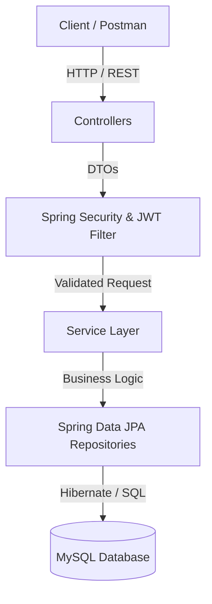
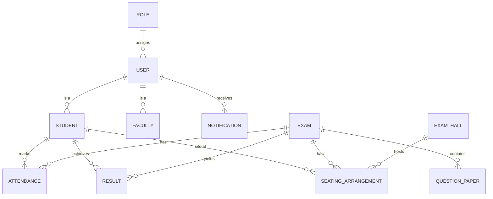

# Secure Examination Management System (SEMS)
## Project Report Documentation

---

## 1. Project Introduction
The **Secure Examination Management System (SEMS)** is a comprehensive, backend-driven application designed to digitize and secure the entire lifecycle of academic examinations. Traditional exam management is highly manual, prone to errors, and vulnerable to security breaches (such as paper leaks). SEMS solves these problems by providing a centralized platform to manage users (students and faculty), schedule exams, allocate seating, securely upload encrypted question papers, track attendance, and publish results. 

## 2. Objectives
- **Digitization & Automation**: To automate exam scheduling, hall ticket generation, and seating arrangements.
- **Security & Confidentiality**: To provide role-based access control (RBAC) ensuring that only authorized personnel (like Paper Setters and Exam Controllers) can access sensitive data like Question Papers.
- **Real-Time Tracking**: To track student attendance and generate real-time metrics via a centralized Dashboard.
- **Automated Communication**: To instantly alert relevant users regarding scheduled exams, generated hall tickets, and published results through an internal Notification engine.
- **Data Integrity**: To securely store user passwords via hashing and ensure sensitive data is not leaked in API responses.

## 3. Technology Stack
- **Backend Framework**: Java 21, Spring Boot 3.x
- **Database**: MySQL 8.x
- **ORM / Data Access**: Spring Data JPA (Hibernate)
- **Security**: Spring Security with JWT (JSON Web Tokens) & BCrypt Password Hashing
- **PDF Generation**: iText7 (For Hall Tickets)
- **API Testing & Documentation**: Postman
- **Build Tool**: Maven

## 4. System Architecture
The system is built on a standard robust **N-Tier Spring Boot Architecture**.

## 5. Entity-Relationship (ER) Diagram
Below is the ER Diagram mapping the relationships between our core database entities.

## 6. Database Schema Overview
- **`roles`**: Defines system roles (`SUPER_ADMIN`, `EXAM_CONTROLLER`, `PAPER_SETTER`, `FACULTY`, `STUDENT`).
- **`users`**: Core authentication table containing encrypted passwords and role mappings.
- **`students` / `faculty`**: Stores specific profile details tied to user accounts.
- **`exams`**: Stores scheduling data (date, time, duration, marks).
- **`exam_halls`**: Stores physical infrastructure data (building, floor, capacity).
- **`seating_arrangements`**: Junction mapping linking a Student to an Exam and an Exam Hall with a specific seat number.
- **`question_papers`**: Securely stores file paths/links to encrypted question papers uploaded by paper setters.
- **`attendance`**: Tracks `PRESENT`/`ABSENT` status for students per exam.
- **`results`**: Stores marks and grades; includes a `published` boolean flag.
- **`notifications`**: Stores targeted alerts for users based on system events.

## 7. API Documentation Summary
All endpoints are secured via `Bearer <JWT_TOKEN>`.

| Module | Endpoint | Method | Role Required |
|--------|----------|--------|---------------|
| **Auth** | `/api/auth/register` | `POST` | *None* |
| **Auth** | `/api/auth/login` | `POST` | *None* |
| **Exams** | `/api/exams` | `POST` | `SUPER_ADMIN`, `EXAM_CONTROLLER` |
| **Exams** | `/api/exams` | `GET` | *Authenticated Users* |
| **Halls** | `/api/exam-halls` | `POST` | `SUPER_ADMIN`, `EXAM_CONTROLLER` |
| **Seating** | `/api/seating` | `POST` | `SUPER_ADMIN`, `EXAM_CONTROLLER` |
| **Papers** | `/api/question-papers`| `POST` | `PAPER_SETTER` |
| **Attendance**| `/api/attendance` | `POST` | `FACULTY`, `EXAM_CONTROLLER` |
| **Results** | `/api/results/publish/{examId}`| `PUT` | `EXAM_CONTROLLER` |
| **Results** | `/api/results/student/{studentId}`| `GET` | `STUDENT` (Self only) |
| **Dashboard** | `/api/dashboard/summary` | `GET` | `SUPER_ADMIN`, `EXAM_CONTROLLER` |

## 8. Module-wise Explanation
1. **Authentication & Authorization**: Utilizes JWT for stateless authentication. Passwords are encrypted using BCrypt. Role-based access ensures that (for example) students cannot upload question papers.
2. **Exam & Hall Management**: Allows administrators to define exams and physical exam halls with specific capacities.
3. **Seating Arrangement**: Algorithms assign students to specific halls and seat numbers based on capacity limits.
4. **Hall Ticket Generation**: Generates a downloadable PDF containing student details, exam timings, seat numbers, and instructions using the iText7 library.
5. **Question Paper Security**: A strict module where only `PAPER_SETTER`s can upload papers. Triggers audit logs and alerts `SUPER_ADMIN`s upon upload.
6. **Attendance & Results**: Faculty can mark attendance. Exam controllers can upload results, but they remain hidden from students until explicitly "Published".
7. **Dashboard & Analytics**: Provides real-time aggregated metrics (total students, present/absent ratios, total exams) for administrative oversight.
8. **Notifications**: An automated event-driven engine that alerts users (e.g., notifying students when their results are published or exams are scheduled).

## 9. Screenshots for Project Report
*Note: To complete your physical report, capture screenshots of the following Postman requests:*
1. **Login Success (Auth)**: Screenshot the `POST /api/auth/login` response showing the JWT Token.
2. **Dashboard Metrics**: Screenshot the `GET /api/dashboard/summary` showing the JSON counts of students, faculty, etc.
3. **Seating Arrangement**: Screenshot the `GET /api/seating/exam/{id}` showing a student assigned to an Exam Hall.
4. **Notification**: Screenshot the `GET /api/notifications` showing the automated "Exam Scheduled" or "Result Published" message.
5. **Security Error**: Screenshot a `403 Forbidden` error (e.g., trying to upload a question paper using a Student token) to prove Role-Based Access Control works.

## 10. Future Enhancements
- **Frontend Integration**: Build a React.js or Angular frontend to consume the API.
- **Advanced Encryption**: Implement AES-256 encryption on the actual Question Paper files before saving them to disk.
- **Email/SMS Integration**: Connect the Notification module to a service like SendGrid or Twilio to send actual emails and text messages to students.
- **AI Proctoring**: Integrate webcam-based AI monitoring for remote/online examinations.
